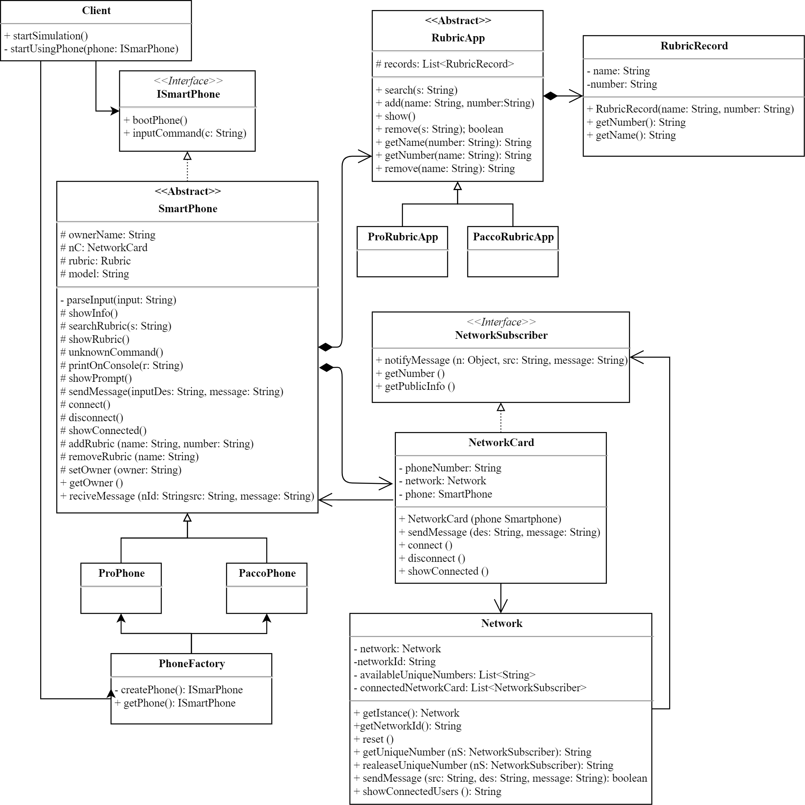

# PhoneSimulator
 Repository per il codice del progetto di Ingegneria del Software
 
 
 ### Documentazione
 [Documentazione completa](https://docs.google.com/document/d/1Qp8zCO5xep3hJsoPorasWVTrHCBqD0262AY88BYDcUI/edit?usp=sharing)
 
 Sono consentiti (e richiesti) i commenti
 
 
 ### UML software
 

